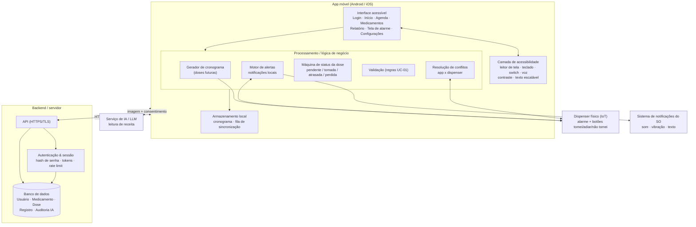
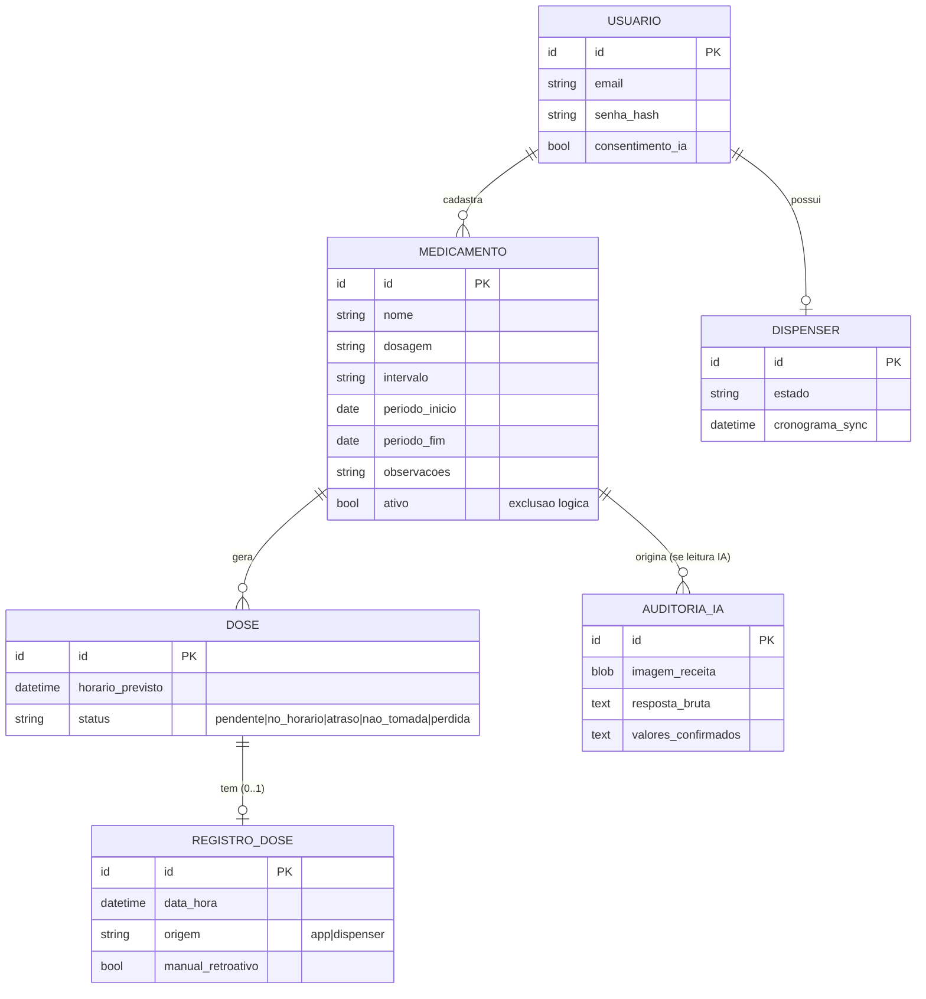

# Vídia — Arquitetura e componentes

## Diagrama de componentes

```mermaid
flowchart TB
    subgraph APP["App móvel (Android / iOS)"]
        UI["Interface acessível<br/>Login · Início · Agenda · Medicamentos<br/>Relatório · Tela de alarme · Configurações"]
        A11Y["Camada de acessibilidade<br/>leitor de tela · teclado · switch · voz<br/>contraste · texto escalável"]
        subgraph PROC["Processamento / lógica de negócio"]
            SCHED["Gerador de cronograma<br/>(doses futuras)"]
            ALERT["Motor de alertas<br/>notificações locais"]
            STATUS["Máquina de status da dose<br/>pendente / tomada / atrasada / perdida"]
            VALID["Validação (regras UC-01)"]
            CONF["Resolução de conflitos<br/>app x dispenser"]
        end
        LOCALDB["Armazenamento local<br/>cronograma · fila de sincronização"]
    end

    subgraph BACK["Backend / servidor"]
        AUTH["Autenticação & sessão<br/>hash de senha · tokens · rate limit"]
        API["API (HTTPS/TLS)"]
        DB[("Banco de dados<br/>Usuário · Medicamento · Dose<br/>Registro · Auditoria IA")]
    end

    IA["Serviço de IA / LLM<br/>leitura de receita"]
    DISP["Dispenser físico (IoT)<br/>alarme + botões tomei/adiar/não tomei"]
    NOTIF["Sistema de notificações do SO<br/>som · vibração · texto"]

    UI <--> A11Y
    UI --> PROC
    PROC --> LOCALDB
    ALERT --> NOTIF
    ALERT <--> DISP
    SCHED --> DISP
    CONF <--> DISP

    APP <-->|HTTPS/TLS| API
    API --> AUTH
    API --> DB
    AUTH --> DB
    APP <-->|imagem + consentimento| IA

    classDef ext fill:#eef,stroke:#669;
    class IA,DISP,NOTIF ext;
```

## Modelo de dados (entidades principais)

```mermaid
erDiagram
    USUARIO ||--o{ MEDICAMENTO : cadastra
    USUARIO ||--o| DISPENSER : possui
    MEDICAMENTO ||--o{ DOSE : gera
    DOSE ||--o| REGISTRO_DOSE : "tem (0..1)"
    MEDICAMENTO ||--o{ AUDITORIA_IA : "origina (se leitura IA)"

    USUARIO {
        id id PK
        string email
        string senha_hash
        bool consentimento_ia
    }
    MEDICAMENTO {
        id id PK
        string nome
        string dosagem
        string intervalo
        date   periodo_inicio
        date   periodo_fim
        string observacoes
        bool   ativo "exclusao logica"
    }
    DOSE {
        id id PK
        datetime horario_previsto
        string status "pendente|no_horario|atraso|nao_tomada|perdida"
    }
    REGISTRO_DOSE {
        id id PK
        datetime data_hora
        string origem "app|dispenser"
        bool   manual_retroativo
    }
    DISPENSER {
        id id PK
        string estado
        datetime cronograma_sync
    }
    AUDITORIA_IA {
        id id PK
        blob   imagem_receita
        text   resposta_bruta
        text   valores_confirmados
    }
```
