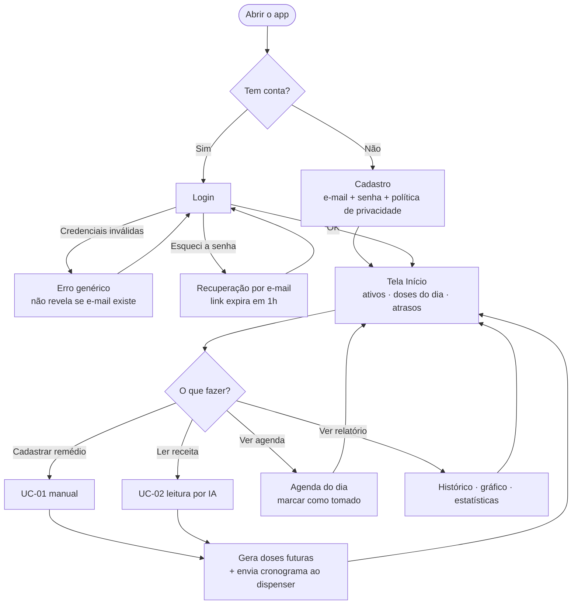
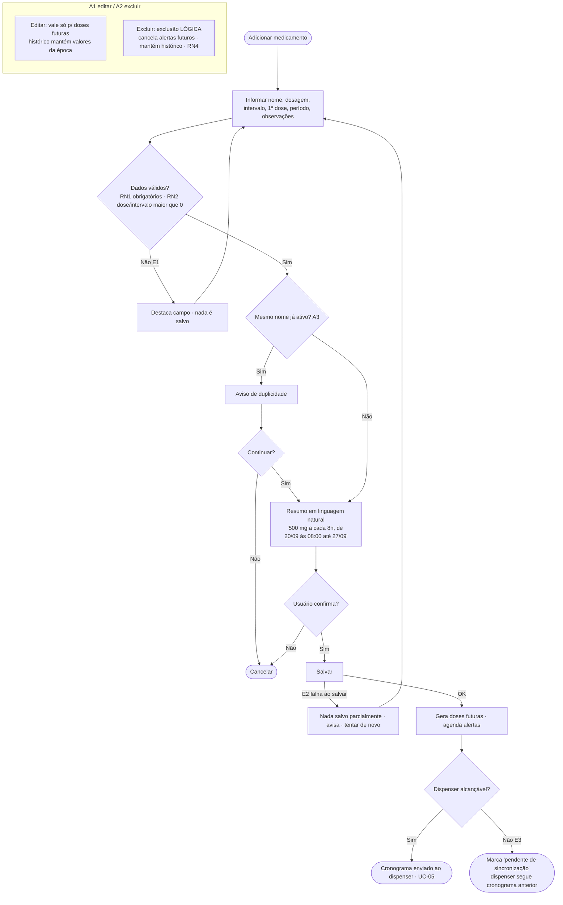
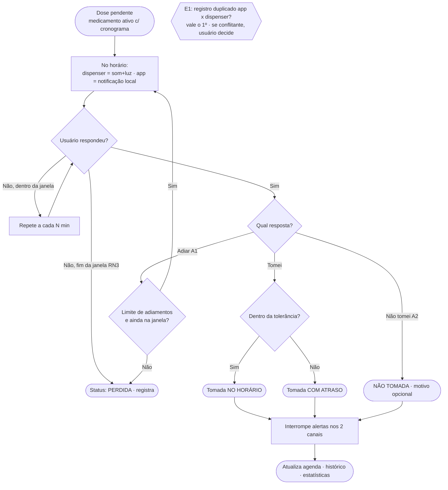

# Vídia — Fluxogramas de operação

## 1. Fluxo geral do usuário

```mermaid
flowchart TD
    START([Abrir o app]) --> HASACC{Tem conta?}
    HASACC -->|Não| CAD[Cadastro<br/>e-mail + senha + política de privacidade]
    HASACC -->|Sim| LOGIN[Login]
    LOGIN -->|Credenciais inválidas| ERR[Erro genérico<br/>não revela se e-mail existe]
    ERR --> LOGIN
    LOGIN -->|Esqueci a senha| REC[Recuperação por e-mail<br/>link expira em 1h]
    REC --> LOGIN
    CAD --> HOME
    LOGIN -->|OK| HOME[Tela Início<br/>ativos · doses do dia · atrasos]

    HOME --> ACT{O que fazer?}
    ACT -->|Cadastrar remédio| UC01[UC-01 manual]
    ACT -->|Ler receita| UC02[UC-02 leitura por IA]
    ACT -->|Ver agenda| AGENDA[Agenda do dia<br/>marcar como tomado]
    ACT -->|Ver relatório| REL[Histórico · gráfico · estatísticas]
    UC01 --> SCHED[Gera doses futuras<br/>+ envia cronograma ao dispenser]
    UC02 --> SCHED
    SCHED --> HOME
    AGENDA --> HOME
    REL --> HOME
```

## 2. UC-01 — Cadastrar / editar / excluir medicamento

```mermaid
flowchart TD
    A([Adicionar medicamento]) --> B[Informar nome, dosagem,<br/>intervalo, 1ª dose, período, observações]
    B --> C{"Dados válidos?<br/>RN1 obrigatórios · RN2 dose/intervalo maior que 0"}
    C -->|Não E1| C1[Destaca campo · nada é salvo] --> B
    C -->|Sim| D{Mesmo nome já ativo? A3}
    D -->|Sim| D1[Aviso de duplicidade]
    D1 --> D2{Continuar?}
    D2 -->|Não| X([Cancelar])
    D2 -->|Sim| E
    D -->|Não| E[Resumo em linguagem natural<br/>'500 mg a cada 8h, de 20/09 às 08:00 até 27/09']
    E --> F{Usuário confirma?}
    F -->|Não| X
    F -->|Sim| G[Salvar]
    G -->|E2 falha ao salvar| G1[Nada salvo parcialmente · avisa · tentar de novo] --> B
    G -->|OK| H[Gera doses futuras · agenda alertas]
    H --> I{Dispenser alcançável?}
    I -->|Sim| J([Cronograma enviado ao dispenser · UC-05])
    I -->|Não E3| K([Marca 'pendente de sincronização'<br/>dispenser segue cronograma anterior])

    subgraph Edit["A1 editar / A2 excluir"]
      direction TB
      ED[Editar: vale só p/ doses futuras<br/>histórico mantém valores da época]
      EX[Excluir: exclusão LÓGICA<br/>cancela alertas futuros · mantém histórico · RN4]
    end
```

## 3. UC-03 / UC-04 — Alerta e resposta à dose (ciclo de vida da dose)

```mermaid
flowchart TD
    P([Dose pendente<br/>medicamento ativo c/ cronograma]) --> AL[No horário:<br/>dispenser = som+luz · app = notificação local]
    AL --> W{Usuário respondeu?}
    W -->|Não, dentro da janela| REP[Repete a cada N min] --> W
    W -->|Não, fim da janela RN3| LOST(["Status: PERDIDA · registra"])
    W -->|Sim| R{Qual resposta?}
    R -->|Tomei| T{Dentro da tolerância?}
    T -->|Sim| T1([Tomada NO HORÁRIO])
    T -->|Não| T2([Tomada COM ATRASO])
    R -->|Adiar A1| SNZ{Limite de adiamentos<br/>e ainda na janela?}
    SNZ -->|Sim| AL
    SNZ -->|Não| LOST
    R -->|Não tomei A2| NT([NÃO TOMADA · motivo opcional])
    T1 --> STOP[Interrompe alertas nos 2 canais]
    T2 --> STOP
    NT --> STOP
    STOP --> UPD([Atualiza agenda · histórico · estatísticas])

    CONF{{"E1: registro duplicado app x dispenser?<br/>vale o 1º · se conflitante, usuário decide"}}
```
